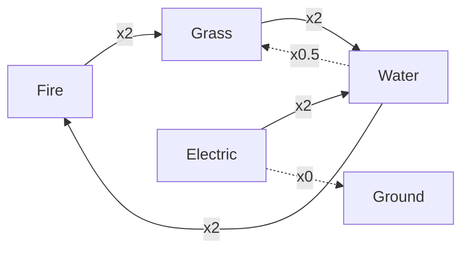
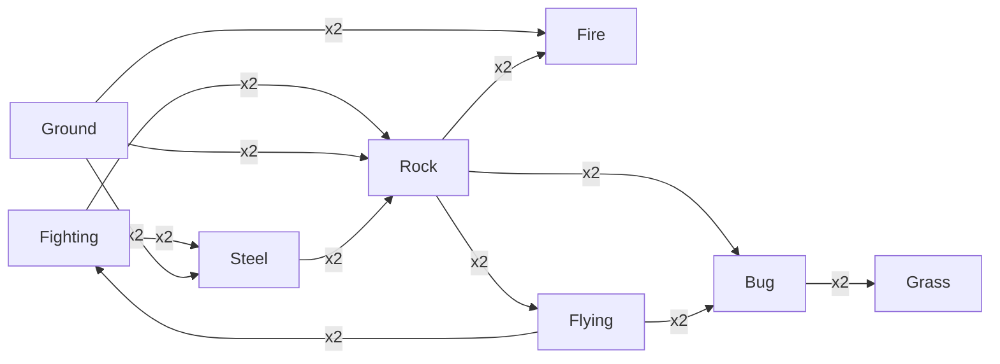
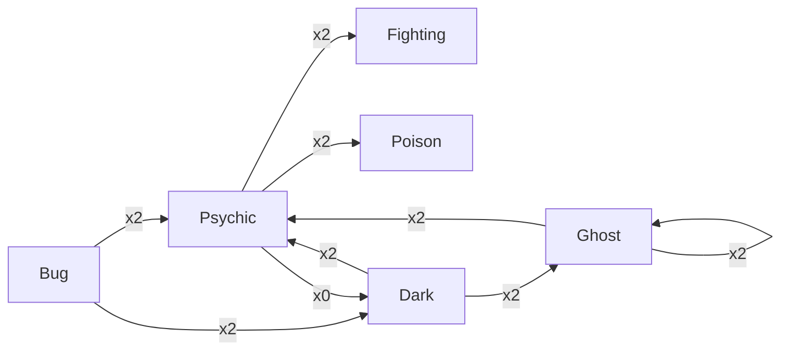
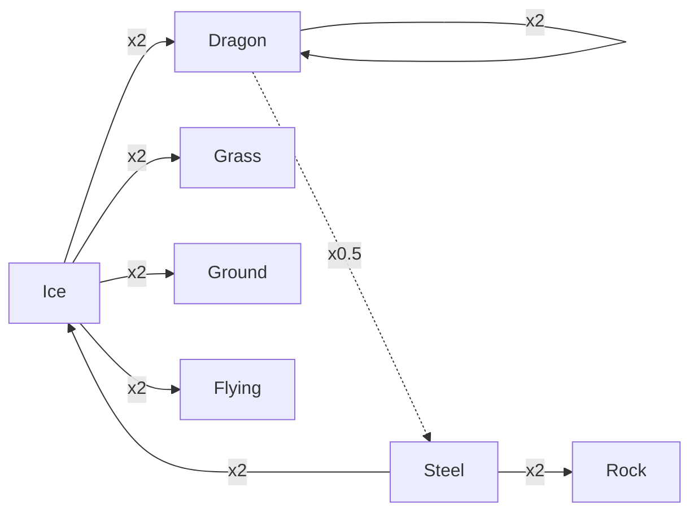
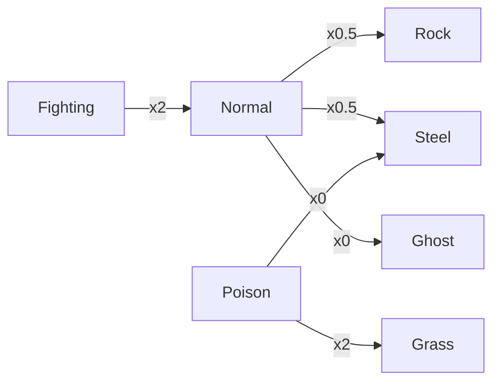

# Gen 2 type chart — Notion paste source

Generated from `data/types/type_matchups.asm`. Do not edit by hand; re-run script.

Callout: Gen 2 has 17 types (no Fairy). Foresight removes Ghost immunities to Normal/Fighting.

## Mermaid: Classic

_Notes: Fire also x2 vs Ice/Bug/Steel; Grass x2 vs Ground/Rock; Electric x2 vs Flying._

## Mermaid: Rock-Ground-Fighting

_Notes: Ground x0 vs Flying; Fighting x0 vs Ghost (Foresight removes); Flying x0.5 vs Rock/Steel._

## Mermaid: Psychic-axis

## Mermaid: Ice-Dragon

## Mermaid: Misc

_Foresight / Odor Sleuth: ignores Ghost immunities to Normal and Fighting._

## Toggle: Normal

### โจมตีด้วย Normal
- ×2: —
- ×0.5: Rock, Steel
- ×0: Ghost

### โดน Normal เข้า
- ×2 จาก: Fighting
- ×0.5 จาก: —
- ×0 จาก: Ghost

## Toggle: Fighting

### โจมตีด้วย Fighting
- ×2: Dark, Ice, Normal, Rock, Steel
- ×0.5: Bug, Flying, Poison, Psychic
- ×0: Ghost

### โดน Fighting เข้า
- ×2 จาก: Flying, Psychic
- ×0.5 จาก: Bug, Dark, Rock
- ×0 จาก: —

## Toggle: Flying

### โจมตีด้วย Flying
- ×2: Bug, Fighting, Grass
- ×0.5: Electric, Rock, Steel
- ×0: —

### โดน Flying เข้า
- ×2 จาก: Electric, Ice, Rock
- ×0.5 จาก: Bug, Fighting, Grass
- ×0 จาก: Ground

## Toggle: Poison

### โจมตีด้วย Poison
- ×2: Grass
- ×0.5: Ghost, Ground, Poison, Rock
- ×0: Steel

### โดน Poison เข้า
- ×2 จาก: Ground, Psychic
- ×0.5 จาก: Bug, Fighting, Grass, Poison
- ×0 จาก: —

## Toggle: Ground

### โจมตีด้วย Ground
- ×2: Electric, Fire, Poison, Rock, Steel
- ×0.5: Bug, Grass
- ×0: Flying

### โดน Ground เข้า
- ×2 จาก: Grass, Ice, Water
- ×0.5 จาก: Poison, Rock
- ×0 จาก: Electric

## Toggle: Rock

### โจมตีด้วย Rock
- ×2: Bug, Fire, Flying, Ice
- ×0.5: Fighting, Ground, Steel
- ×0: —

### โดน Rock เข้า
- ×2 จาก: Fighting, Grass, Ground, Steel, Water
- ×0.5 จาก: Fire, Flying, Normal, Poison
- ×0 จาก: —

## Toggle: Bug

### โจมตีด้วย Bug
- ×2: Dark, Grass, Psychic
- ×0.5: Fighting, Fire, Flying, Ghost, Poison, Steel
- ×0: —

### โดน Bug เข้า
- ×2 จาก: Fire, Flying, Rock
- ×0.5 จาก: Fighting, Grass, Ground
- ×0 จาก: —

## Toggle: Ghost

### โจมตีด้วย Ghost
- ×2: Ghost, Psychic
- ×0.5: Dark, Steel
- ×0: Normal

### โดน Ghost เข้า
- ×2 จาก: Dark, Ghost
- ×0.5 จาก: Bug, Poison
- ×0 จาก: Fighting, Normal

## Toggle: Steel

### โจมตีด้วย Steel
- ×2: Ice, Rock
- ×0.5: Electric, Fire, Steel, Water
- ×0: —

### โดน Steel เข้า
- ×2 จาก: Fighting, Fire, Ground
- ×0.5 จาก: Bug, Dark, Dragon, Flying, Ghost, Grass, Ice, Normal, Psychic, Rock, Steel
- ×0 จาก: Poison

## Toggle: Fire

### โจมตีด้วย Fire
- ×2: Bug, Grass, Ice, Steel
- ×0.5: Dragon, Fire, Rock, Water
- ×0: —

### โดน Fire เข้า
- ×2 จาก: Ground, Rock, Water
- ×0.5 จาก: Bug, Fire, Grass, Ice, Steel
- ×0 จาก: —

## Toggle: Water

### โจมตีด้วย Water
- ×2: Fire, Ground, Rock
- ×0.5: Dragon, Grass, Water
- ×0: —

### โดน Water เข้า
- ×2 จาก: Electric, Grass
- ×0.5 จาก: Fire, Ice, Steel, Water
- ×0 จาก: —

## Toggle: Grass

### โจมตีด้วย Grass
- ×2: Ground, Rock, Water
- ×0.5: Bug, Dragon, Fire, Flying, Grass, Poison, Steel
- ×0: —

### โดน Grass เข้า
- ×2 จาก: Bug, Fire, Flying, Ice, Poison
- ×0.5 จาก: Electric, Grass, Ground, Water
- ×0 จาก: —

## Toggle: Electric

### โจมตีด้วย Electric
- ×2: Flying, Water
- ×0.5: Dragon, Electric, Grass
- ×0: Ground

### โดน Electric เข้า
- ×2 จาก: Ground
- ×0.5 จาก: Electric, Flying, Steel
- ×0 จาก: —

## Toggle: Psychic

### โจมตีด้วย Psychic
- ×2: Fighting, Poison
- ×0.5: Psychic, Steel
- ×0: Dark

### โดน Psychic เข้า
- ×2 จาก: Bug, Dark, Ghost
- ×0.5 จาก: Fighting, Psychic
- ×0 จาก: —

## Toggle: Ice

### โจมตีด้วย Ice
- ×2: Dragon, Flying, Grass, Ground
- ×0.5: Fire, Ice, Steel, Water
- ×0: —

### โดน Ice เข้า
- ×2 จาก: Fighting, Fire, Rock, Steel
- ×0.5 จาก: Ice
- ×0 จาก: —

## Toggle: Dragon

### โจมตีด้วย Dragon
- ×2: Dragon
- ×0.5: Steel
- ×0: —

### โดน Dragon เข้า
- ×2 จาก: Dragon, Ice
- ×0.5 จาก: Electric, Fire, Grass, Water
- ×0 จาก: —

## Toggle: Dark

### โจมตีด้วย Dark
- ×2: Ghost, Psychic
- ×0.5: Dark, Fighting, Steel
- ×0: —

### โดน Dark เข้า
- ×2 จาก: Bug, Fighting
- ×0.5 จาก: Dark, Ghost
- ×0 จาก: Psychic
